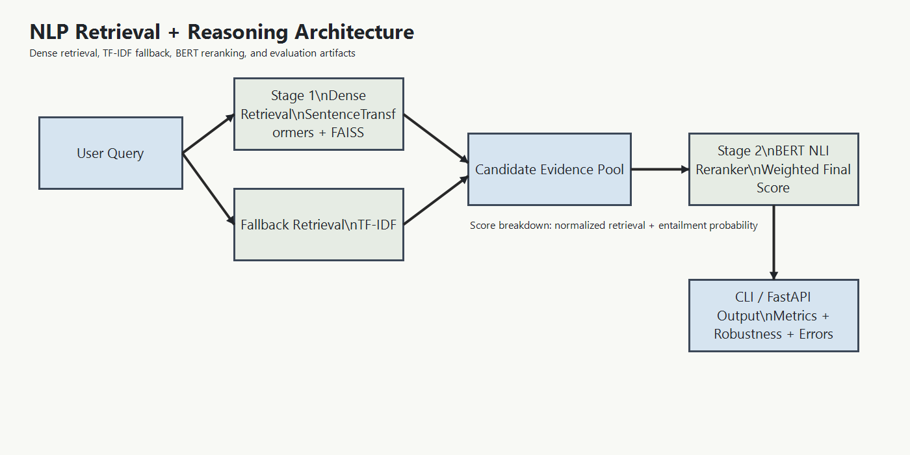

# NLP Retrieval and Reasoning System
Production-style two-stage retrieval and NLI reranking system for evidence search, entailment scoring, and evaluation beyond headline accuracy.

## Key Highlights

- Two-stage pipeline: SentenceTransformers + FAISS retrieval, TF-IDF fallback, and BERT-based NLI reranking with weighted score fusion.
- Evaluation is multi-signal by design: clean validation/test metrics, curated hard-set performance, and robustness under typo, paraphrase, and shuffle perturbations.
- Synthetic data augmentation targets known failure modes instead of adding generic noise.
- Reproducible experiment tracking exports configs, checkpoints, metrics, robustness reports, error analysis, and run summaries.
- Supports both CLI inference and FastAPI serving for local testing and lightweight deployment.

## Architecture Overview

- Stage 1 retrieves candidate evidence with dense embeddings and FAISS; TF-IDF provides a fallback retrieval path.
- Stage 2 reranks candidates with a `bert-base-uncased` NLI classifier and combines normalized retrieval score with entailment probability.
- The same pipeline is exposed through a CLI entrypoint and a FastAPI service.

Diagram: [docs/architecture.png](docs/architecture.png) | Source: [docs/architecture.mmd](docs/architecture.mmd)



## Experimental Results

Run4 is the current targeted-augmentation checkpoint in [outputs/run4](outputs/run4).

| Metric | Score |
| --- | --- |
| Validation Accuracy | 43.60% |
| Validation Macro F1 | 43.45% |
| Test Accuracy | 43.30% |
| Test Macro F1 | 43.23% |
| Hard-Set Accuracy | 39.82% |
| Hard-Set Macro F1 | 30.14% |
| Typo Robustness Macro F1 | 35.41% |
| Paraphrase Robustness Macro F1 | 43.26% |
| Shuffle Robustness Macro F1 | 35.91% |

Targeted augmentation improved the previous augmented run across validation, test, hard-set, and all robustness slices; validation Macro F1 rose from 40.03% to 43.45% and hard-set Macro F1 from 27.60% to 30.14%. The remaining weakness is reasoning stability under adversarial word order and hard cases, where shuffle robustness and hard-set Macro F1 remain materially below clean-split performance.

## Training Strategy

- Model: `bert-base-uncased` fine-tuned for 3-way NLI classification and reused as the reranker.
- Augmentation: 1,498 validated synthetic examples mixed into training at an 8.84% synthetic/original ratio, capped by an `augmentation_max_ratio` of `0.25`.
- Targeted categories: 500 negation, 300 numeric contradiction, 300 temporal/date reasoning, 398 long-premise short-hypothesis reasoning.
- Optimization: 5 epochs, max length 256, batch size 4 with gradient accumulation 4 for effective batch size 16, AdamW, `1e-5` learning rate, 10% warmup, gradient clipping, and early stopping.

## Evaluation Framework

- Hard-set evaluation treats long-sequence reasoning, negation, and numeric/date cases as first-class quality gates rather than edge cases.
- Robustness tests measure degradation under typos, paraphrases, and shuffled text to catch brittle lexical heuristics.
- A promotion-gate workflow compares runs on validation, hard-set, and robustness metrics while requiring reproducible artifacts for every experiment.

## Quick Start

```bash
pip install -r requirements.txt
python train.py --config-path configs/bert_run4.json
python scripts/summarize_run.py --run outputs/run4 --baseline outputs/bert_nli
```

## Example Usage

```bash
python main.py --corpus-path data/test.json --query "Several men are playing soccer outdoors." --checkpoint-dir outputs/run4
```

API serving is also available via `uvicorn api.app:app --reload`.

## Project Structure

```text
api/           FastAPI inference service
configs/       Training and augmentation configs
data/          Base datasets, hard set, and generated synthetic samples
evaluation/    Metrics, robustness, hard-set, and run-comparison utilities
models/        BERT and baseline NLI models
retrieval/     Dense retrieval and fallback search backends
scripts/       Data generation, evaluation, and reporting workflows
outputs/       Checkpoints and exported run artifacts
docs/          Architecture and benchmark documentation
```

## Key Insights

- The project separates retrieval quality from reasoning quality, which makes latency, ranking quality, and NLI accuracy measurable independently.
- Targeted synthetic augmentation is directionally useful: compared with the earlier augmented run, Run4 improved validation Macro F1 by `+3.41` points, test Macro F1 by `+2.69` points, and hard-set Macro F1 by `+2.53` points.
- The current augmentation recipe still does not beat the original clean baseline on test Macro F1 (`43.23%` vs `47.02%`), so data quality and calibration are still bottlenecks.
- Reranking improves retrieval only slightly while adding major latency: MRR moves from `0.8376` to `0.8404`, while average latency rises from `9.14 ms` to `638.62 ms`.
- Hard-set and shuffle results show the core remaining challenge is compositional reasoning, especially under negation, long-context evidence, and numeric or temporal logic.

## Future Improvements

- Replace fixed score fusion with calibrated or learned ranking.
- Add a stronger cross-encoder reranker and track the accuracy-latency Pareto frontier.
- Expand the reviewed hard set for contradiction-heavy numeric, temporal, and multi-step reasoning cases.
- Tighten synthetic data filtering so targeted gains translate into stronger clean-test performance.
