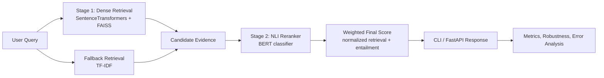

# NLP Retrieval and Reasoning System

This repository turns an NLI coursework notebook into a modular retrieval-and-reasoning system that is easier to benchmark, explain, and deploy. The project centers on a two-stage pipeline:

1. Stage 1 dense retrieval with SentenceTransformers + FAISS, with TF-IDF fallback.
2. Stage 2 NLI reranking with a BERT classifier that scores entailment against each retrieved candidate.

The project now treats evaluation as a multi-signal decision rather than a single headline number. A run is considered strong only if it performs well on clean validation/test splits, hard reasoning cases, robustness checks, and reproducibility artifacts.

## Architecture Diagram

Rendered diagram: [docs/architecture.png](docs/architecture.png)
Source diagram: [docs/architecture.mmd](docs/architecture.mmd)




## Models and Baselines

- `BERT`: main high-capacity NLI classifier and reranker.
- `BiLSTM`: recurrent baseline for sequence modeling comparison.
- `TextCNN`: non-recurrent baseline for lightweight classification.
- `SentenceTransformers + FAISS`: dense retriever.
- `TF-IDF`: offline-safe retrieval fallback.

## Evaluation Policy

A candidate run should only be treated as improved if it:

- improves clean validation macro F1,
- improves or at least does not materially regress on the hard set,
- does not materially collapse on typo and shuffle robustness,
- and writes a reproducible artifact set including config, metrics, robustness, and run summary files.

The hard-set benchmark is now first-class and focuses on the dominant failure buckets identified from earlier runs:

- `long_sequence`
- `negation`
- `numeric_date` for numeric, date, and temporal reasoning heuristics

## Benchmark Artifacts

Current benchmark snapshots live in:

- [results/classification_results.csv](results/classification_results.csv)
- [results/retrieval_metrics.csv](results/retrieval_metrics.csv)
- [results/robustness_summary.csv](results/robustness_summary.csv)
- [data/eval/hard_set.json](data/eval/hard_set.json)

Append-only experiment history lives in:

- `experiments/results/summary.csv`
- `experiments/results/retrieval_history.csv`

## Benchmark Results

The tables below reflect the fully exported baseline runs currently checked into the repo.

### Classification Benchmarks

| Model | Split | Accuracy | Macro F1 | Artifact |
| --- | --- | --- | --- | --- |
| BERT NLI | validation | 0.444 | 0.4433 | `outputs/bert_nli` |
| BERT NLI | test | 0.470 | 0.4702 | `outputs/bert_nli` |
| BiLSTM baseline | validation | 0.333 | 0.1665 | `outputs/bilstm_baseline` |
| BiLSTM baseline | test | 0.333 | 0.1665 | `outputs/bilstm_baseline` |
| TextCNN baseline | validation | 0.332 | 0.1701 | `outputs/textcnn_baseline` |
| TextCNN baseline | test | 0.330 | 0.1675 | `outputs/textcnn_baseline` |

### Retrieval Benchmark Ledger

| Backend | Reranking | Recall@1 | Recall@3 | Recall@5 | MRR | Avg latency |
| --- | --- | --- | --- | --- | --- | --- |
| FAISS dense retrieval | off | 0.746 | 0.925 | 0.949 | 0.8376 | 9.14 ms |
| FAISS + BERT reranker | on | 0.746 | 0.933 | 0.954 | 0.8404 | 638.62 ms |

### Robustness Summary

| Model | Perturbation | Accuracy | Macro F1 |
| --- | --- | --- | --- |
| BERT NLI | typo | 0.417 | 0.3898 |
| BERT NLI | paraphrase | 0.446 | 0.4452 |
| BERT NLI | shuffle | 0.390 | 0.3493 |

### Training Progress

| Run | Main setup | Best validation accuracy | Best validation macro F1 | Notes |
| --- | --- | --- | --- | --- |
| 1st training | `bert-base-uncased`, `epochs=2`, `batch_size=4`, `max_length=128` | 0.444 | 0.4433 | Fully exported in `outputs/bert_nli`. |
| 2nd training | `bert-base-uncased`, `epochs=5`, `batch_size=4`, `max_length=256`, accumulation, warmup, clipping, patience=2 | 0.471 | 0.4681 | Best score appeared at epoch 5 in the training log; only checkpoint and config were exported. |

Compared with the 1st training, the 2nd BERT run improved validation accuracy by `+0.027` and validation macro F1 by `+0.0248`. The gain is real but still modest for a balanced 3-class NLI task, and the main remaining issues are long-context reasoning, negation handling, and weak robustness under shuffle and typo noise.

## Hard-Set Workflow

Build the curated hard set from the latest exported error analysis:

```bash
python scripts/build_hard_set.py
```

Evaluate a checkpoint on the hard set:

```bash
python scripts/eval_hard_set.py --checkpoint outputs/bert_nli_tuned
```

This writes `hard_set_metrics.json` under the checkpoint directory by default and reports:

- hard-set accuracy
- hard-set macro F1
- per-bucket results for `negation`, `long_sequence`, and `numeric_date`

## Run Comparison and Promotion Gate

Compare two runs with the rule-based promotion gate:

```bash
python scripts/compare_runs.py --base outputs/bert_nli --candidate outputs/bert_nli_tuned
```

Summarize a single run and optionally compare it with the baseline:

```bash
python scripts/summarize_run.py --run outputs/bert_nli_tuned
```

The comparison workflow checks:

- validation accuracy and macro F1
- test accuracy and macro F1
- typo robustness
- paraphrase robustness
- shuffle robustness
- hard-set performance

## Targeted Augmentation

Generate targeted synthetic NLI data for the main failure buckets:

```bash
python scripts/generate_targeted_nli_data.py --negation 500 --numeric 300 --temporal 300 --long_reasoning 400
```

The script writes a separate augmentation file and summary under `data/generated/`. Training can then include it with `augmentation_path` in the run config.

## Run 3 Config

A dedicated run-3 config now lives at [configs/bert_run3.json](configs/bert_run3.json).

Recommended run-3 workflow:

```bash
python scripts/build_hard_set.py
python scripts/generate_targeted_nli_data.py --negation 500 --numeric 300 --temporal 300 --long_reasoning 400 --output-path data/generated/targeted_nli_run3.json
python train.py --config-path configs/bert_run3.json
python scripts/eval_hard_set.py --checkpoint outputs/run
python scripts/compare_runs.py --base outputs/bert_nli --candidate outputs/run
python scripts/summarize_run.py --run outputs/run
```

The training command now supports config-driven runs and writes:

- `training_config.json`
- `metrics.json`
- `error_analysis.json`
- `robustness.json`
- `test_metrics.json`
- `best_run_summary.json`
- `run_status.json`
- `augmentation_summary.json` when augmentation is enabled

## Retrieval and Full Pipeline Commands

Run retrieval benchmarking without reranking:

```bash
python -m evaluation.retrieval_benchmark --corpus-path data/test.json --output-json results/retrieval_metrics.json --output-csv results/retrieval_metrics.csv
```

This overwrites `results/retrieval_metrics.csv` with the current snapshot and appends the same rows to `experiments/results/retrieval_history.csv`.

Run retrieval benchmarking with the BERT reranker:

```bash
python -m evaluation.retrieval_benchmark --corpus-path data/test.json --checkpoint-dir outputs/bert_nli_tuned --output-json results/retrieval_metrics.json --output-csv results/retrieval_metrics.csv
```

Run one query through the full pipeline:

```bash
python main.py --corpus-path data/test.json --query "Several men are playing soccer outdoors." --checkpoint-dir outputs/bert_nli_tuned --output-path results/example_inference.json
```

Start the API:

```bash
uvicorn api.app:app --reload
```

Run tests:

```bash
python -m unittest discover -s tests
```

## Example Inference Output

Excerpt from `results/example_inference.json`:

```json
{
  "query": "Several men are playing soccer outdoors.",
  "top_k": 5,
  "backend": "faiss",
  "reranking_enabled": true,
  "latency_ms": 458.99,
  "results": [
    {
      "doc_id": "610",
      "retrieval_score": 0.29005879163742065,
      "normalized_retrieval_score": 0.38727615338450627,
      "entailment_score": 0.8917219042778015,
      "final_score": 0.7151658914651482
    },
    {
      "doc_id": "76",
      "retrieval_score": 0.29005879163742065,
      "normalized_retrieval_score": 0.38727615338450627,
      "entailment_score": 0.8917219042778015,
      "final_score": 0.7151658914651482
    }
  ]
}
```

## Key Findings

- Retrieval and reranking are separated explicitly, which makes search quality and reasoning quality measurable instead of blended together.
- The 2nd BERT training improves on the 1st validation result, but the gain is still modest on this balanced 3-class task.
- Both BiLSTM and TextCNN largely collapse toward the neutral class under the current training setup, so they are weak comparison points until re-tuned.
- Long-context reasoning, negation, and numeric/date reasoning are now tracked explicitly through the hard-set workflow.
- Reranking improves Recall@3, Recall@5, and MRR only slightly while increasing average latency substantially.

## Project Layout

```text
project/
|-- api/
|-- configs/
|-- data/
|   |-- eval/
|   |-- generated/
|   `-- sample_nli.json
|-- docs/
|-- evaluation/
|-- experiments/
|-- models/
|-- results/
|-- retrieval/
|-- scripts/
|-- tests/
|-- utils/
|-- main.py
|-- pipeline.py
|-- train.py
`-- README.md
```

## Limitations

- The checked-in benchmark tables reflect one local run configuration and should be regenerated whenever datasets, configs, or checkpoints change.
- The retrieval benchmark uses NLI pairs as a proxy retrieval task; a dedicated retrieval-labeled corpus would support stronger claims.
- The current score fusion uses a fixed weight rather than a learned calibration step.
- The hard set is seeded from exported failure analysis plus heuristics, so it should be reviewed and expanded over time.

## Future Work

- Increase hard-set coverage with more reviewed numeric/date and temporal reasoning cases.
- Introduce a stronger cross-encoder reranker and compare it against the current classifier-based reranker.
- Add confusion matrix visualizations and richer benchmark dashboards once refreshed runs are available.
- Extend API responses with trace metadata for retrieval backend, checkpoint version, and per-stage latency.
