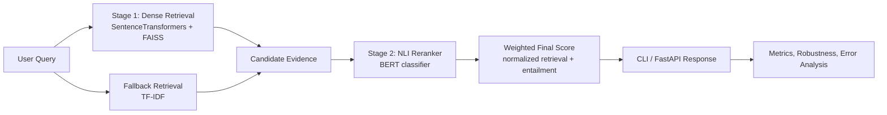

# NLP Retrieval and Reasoning System

This repository turns an NLI coursework notebook into a modular applied NLP system that is easier to benchmark, explain, and deploy. The project centers on a two-stage pipeline:

1. Stage 1 dense retrieval with SentenceTransformers + FAISS, with TF-IDF fallback.
2. Stage 2 NLI reranking with a BERT classifier that scores entailment against each retrieved candidate.

The result is a cleaner portfolio story than a plain classifier demo: we can compare model families, evaluate retrieval quality, inspect reranking behavior, and serve the whole pipeline through FastAPI.

## Architecture Diagram

Rendered diagram: [docs/architecture.png](docs/architecture.png)
Source diagram: [docs/architecture.mmd](docs/architecture.mmd)




## Models and Baselines

- `BERT`: main high-capacity NLI classifier and reranker.
- `BiLSTM`: recurrent baseline for sequence modeling comparison.
- `TextCNN`: non-recurrent baseline for lightweight classification.
- `SentenceTransformers + FAISS`: dense retriever.
- `TF-IDF`: offline-safe retrieval fallback.

## Retrieval and Reasoning Pipeline

The repository now makes the reranking story explicit in both code and outputs.

- Stage 1 retrieves a candidate pool with dense retrieval or TF-IDF fallback.
- Stage 2 scores each candidate with the NLI classifier using the query as hypothesis.
- The pipeline normalizes retrieval scores, combines them with entailment probability, and returns a score breakdown for each result.
- CLI and API responses now expose `retrieval_score`, `normalized_retrieval_score`, `entailment_score`, `final_score`, and `score_breakdown`.

## Experimental Setup

The intended benchmark package is documented in [docs/benchmark.md](docs/benchmark.md).

Core runs:

- BERT vs BiLSTM vs TextCNN classification.
- Dense retrieval vs TF-IDF fallback.
- Reranking off vs reranking on.
- Robustness under typo, paraphrase, and shuffle noise.
- Latency measurement for retrieval and full pipeline inference.

Benchmark ledgers are checked in under [results/classification_results.csv](results/classification_results.csv), [results/retrieval_metrics.csv](results/retrieval_metrics.csv), and [results/robustness_summary.csv](results/robustness_summary.csv).

## Benchmark Results

The repository now includes local JSON splits under `data/` and run artifacts under `outputs/`. The tables below reflect the checked-in outputs from the current local run, not placeholder values.

The current BERT checkpoint was trained with `bert-base-uncased`, `epochs=2`, `batch_size=4`, and `max_length=128`.

### Classification Benchmark Ledger

| Model | Split | Accuracy | Macro F1 | Artifact |
| --- | --- | --- | --- | --- |
| BERT NLI | validation | 0.444 | 0.4433 | `outputs/bert_nli` |
| BERT NLI | test | 0.470 | 0.4702 | `outputs/bert_nli` |
| BiLSTM baseline | validation | 0.333 | 0.1665 | `outputs/bilstm_baseline` |
| BiLSTM baseline | test | 0.333 | 0.1665 | `outputs/bilstm_baseline` |
| TextCNN baseline | validation | 0.332 | 0.1701 | `outputs/textcnn_baseline` |
| TextCNN baseline | test | 0.330 | 0.1675 | `outputs/textcnn_baseline` |

### Retrieval Benchmark Ledger

| Backend | Reranking | Recall@1 | Recall@3 | Recall@5 | MRR | Avg latency |
| --- | --- | --- | --- | --- | --- | --- |
| FAISS dense retrieval | off | 0.746 | 0.925 | 0.949 | 0.8376 | 9.14 ms |
| FAISS + BERT reranker | on | 0.746 | 0.933 | 0.954 | 0.8404 | 638.62 ms |

### Robustness Summary

| Model | Perturbation | Accuracy | Macro F1 |
| --- | --- | --- | --- |
| BERT NLI | typo | 0.417 | 0.3898 |
| BERT NLI | paraphrase | 0.446 | 0.4452 |
| BERT NLI | shuffle | 0.390 | 0.3493 |

## Example Inference Output

Excerpt from `results/example_inference.json`:

```json
{
  "query": "Several men are playing soccer outdoors.",
  "top_k": 5,
  "backend": "faiss",
  "reranking_enabled": true,
  "latency_ms": 458.99,
  "results": [
    {
      "doc_id": "610",
      "retrieval_score": 0.29005879163742065,
      "normalized_retrieval_score": 0.38727615338450627,
      "entailment_score": 0.8917219042778015,
      "final_score": 0.7151658914651482
    },
    {
      "doc_id": "76",
      "retrieval_score": 0.29005879163742065,
      "normalized_retrieval_score": 0.38727615338450627,
      "entailment_score": 0.8917219042778015,
      "final_score": 0.7151658914651482
    }
  ]
}
```

## Error Analysis and Robustness Findings

The repository keeps error analysis and robustness as first-class outputs instead of afterthoughts.

- `evaluation/error_analysis.py` categorizes failures into negation, lexical overlap, long-sequence, and other buckets.
- `evaluation/robustness.py` measures accuracy and macro F1 under typo, paraphrase, and word-order perturbations.
- [docs/error_cases.md](docs/error_cases.md) provides a template for turning raw failures into concrete case studies.

## Key Findings

- Retrieval and reranking are separated explicitly, which makes search quality and reasoning quality measurable instead of blended together.
- The checked-in BERT run is meaningfully better than the lightweight baselines, but it is still only modestly above chance on this balanced 3-class task.
- Both BiLSTM and TextCNN largely collapse toward the neutral class under the current training setup, so they are weak comparison points until re-tuned.
- Reranking improves Recall@3, Recall@5, and MRR only slightly while increasing average latency from about 9 ms to about 639 ms.
- Duplicate premises in the retrieval corpus can surface as repeated top results for free-form queries, as shown in the example inference artifact.

## How to Run

### 1. Install dependencies

```bash
pip install -r requirements.txt
```


### 2. Train the main BERT model

Recommended command:

```bash
python train.py --model-type bert --train-path data/train.json --val-path data/validation.json --test-path data/test.json --output-dir outputs/bert_nli_tuned --epochs 5 --batch-size 4 --max-length 256
```

What this now does by default:
- Uses `bert-base-uncased`
- Uses gradient accumulation for a larger effective batch size
- Uses linear warmup and gradient clipping
- Uses early stopping based on validation macro F1
- Writes metrics, error analysis, robustness, and test results to `outputs/bert_nli_tuned`

Useful optional flags:

```bash
python train.py --model-type bert --train-path data/train.json --val-path data/validation.json --test-path data/test.json --output-dir outputs/bert_custom --epochs 5 --batch-size 4 --max-length 256 --learning-rate 2e-5 --gradient-accumulation-steps 4 --warmup-ratio 0.1 --early-stopping-patience 2
```

### 3. Train all comparison models

If you want BERT, BiLSTM, and TextCNN together, run the helper script:

```bash
bash scripts/run_baselines.sh
```

That script reads:
- `TRAIN_PATH` default: `data/train.json`
- `VAL_PATH` default: `data/validation.json`
- `TEST_PATH` default: `data/test.json`
- `OUTPUT_ROOT` default: `outputs`

If you prefer direct commands instead of the Bash helper:

```bash
python train.py --model-type bert --train-path data/train.json --val-path data/validation.json --test-path data/test.json --output-dir outputs/bert_nli
python train.py --model-type bilstm --train-path data/train.json --val-path data/validation.json --test-path data/test.json --output-dir outputs/bilstm_baseline
python train.py --model-type cnn --train-path data/train.json --val-path data/validation.json --test-path data/test.json --output-dir outputs/textcnn_baseline
```

### 4. Run retrieval benchmarking

Without reranking:

```bash
python -m evaluation.retrieval_benchmark --corpus-path data/test.json --output-json results/retrieval_metrics.json --output-csv results/retrieval_metrics.csv
```

With the trained BERT reranker:

```bash
python -m evaluation.retrieval_benchmark --corpus-path data/test.json --checkpoint-dir outputs/bert_nli_tuned --output-json results/retrieval_metrics.json --output-csv results/retrieval_metrics.csv
```

You can also use the helper script:

```bash
bash scripts/run_retrieval_eval.sh
```

If you use the script, set `CHECKPOINT_DIR` when you want reranking enabled.

### 5. Run one query through the full pipeline

Dense retrieval only:

```bash
python main.py --corpus-path data/test.json --query "Several men are playing soccer outdoors." --disable-reranking --output-path results/example_inference.json
```

Dense retrieval plus BERT reranking:

```bash
python main.py --corpus-path data/test.json --query "Several men are playing soccer outdoors." --checkpoint-dir outputs/bert_nli_tuned --output-path results/example_inference.json
```

This writes a JSON response with `retrieval_score`, `normalized_retrieval_score`, `entailment_score`, `final_score`, and per-stage score breakdowns.

### 6. Start the API

```bash
uvicorn api.app:app --reload
```

### 7. Run tests

```bash
python -m unittest discover -s tests
```

## Project Layout

```text
project/
|-- api/
|-- data/
|   `-- sample_nli.json
|-- docs/
|-- evaluation/
|-- experiments/
|-- models/
|-- results/
|-- retrieval/
|-- scripts/
|-- tests/
|-- utils/
|-- main.py
|-- pipeline.py
|-- train.py
`-- README.md
```

## Limitations

- The checked-in benchmark tables reflect one local run configuration; they should be regenerated whenever hyperparameters, datasets, or checkpoints change.
- The retrieval benchmark uses NLI pairs as a proxy retrieval task; a dedicated retrieval-labeled corpus would support stronger claims.
- The current score fusion uses a fixed weight rather than a learned calibration step.
- Duplicate premises in the corpus can lead to repeated retrieval hits for free-form queries.
- Confusion matrix images and richer qualitative failure galleries still need to be generated after full runs.

## Future Work

- Add calibrated score fusion or a small learning-to-rank layer on top of retrieval and NLI scores.
- Introduce a stronger cross-encoder reranker and compare it against the current classifier-based reranker.
- Add confusion matrix visualizations and richer benchmark dashboards once dataset runs are available.
- Extend API responses with trace metadata for retrieval backend, checkpoint version, and per-stage latency.


